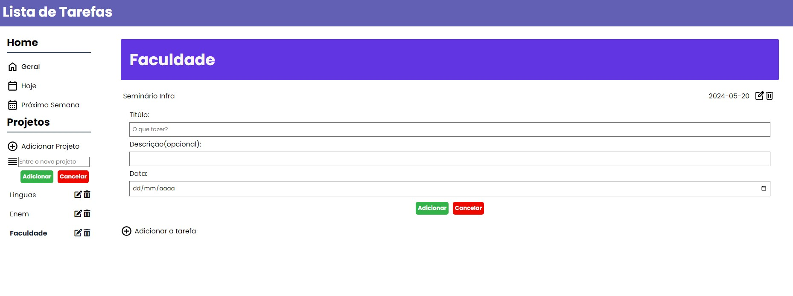

# to-do-list

Este é um aplicativo de lista de tarefas simples que permite aos usuários organizar suas tarefas em projetos e utiliza o armazenamento local do navegador para salvar os dados. O aplicativo foi construído utilizando webpack para o empacotamento dos arquivos.

# Como Executar

1. npm i

2. npm run watch ou npm run build 

# Tecnologias Utilizadas

- Webpack

- HTML, CSS e JavaScript

- Font Awesome

- Google Fonts (Poppins)